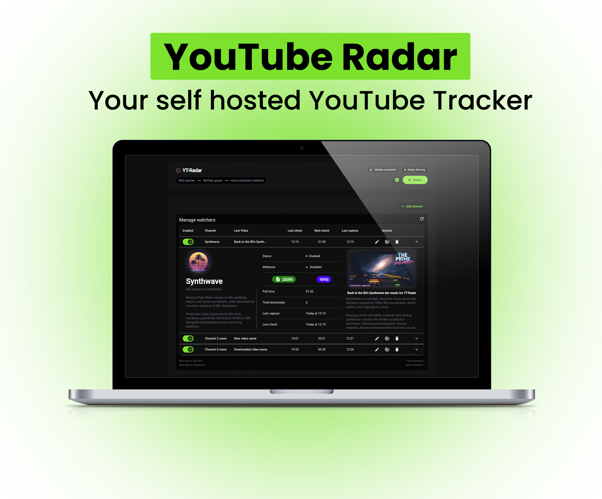
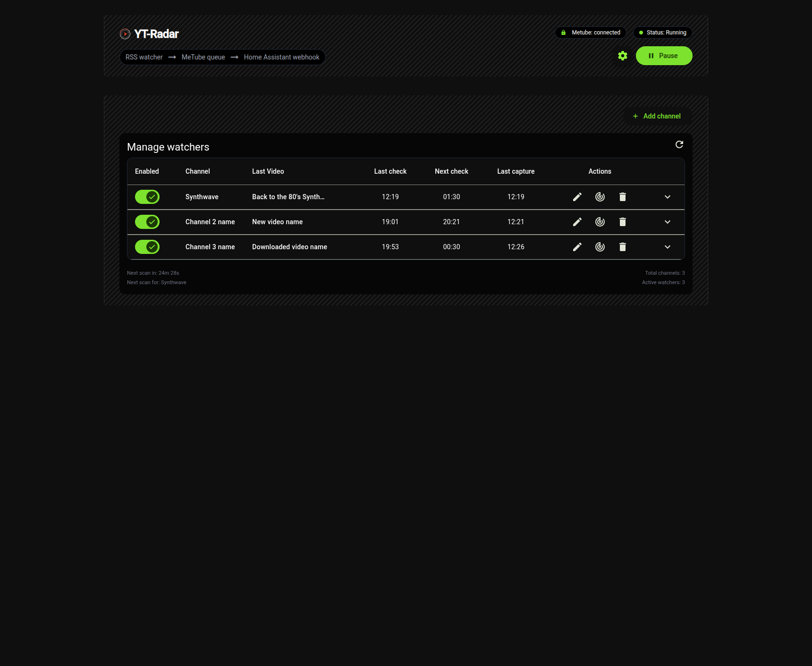
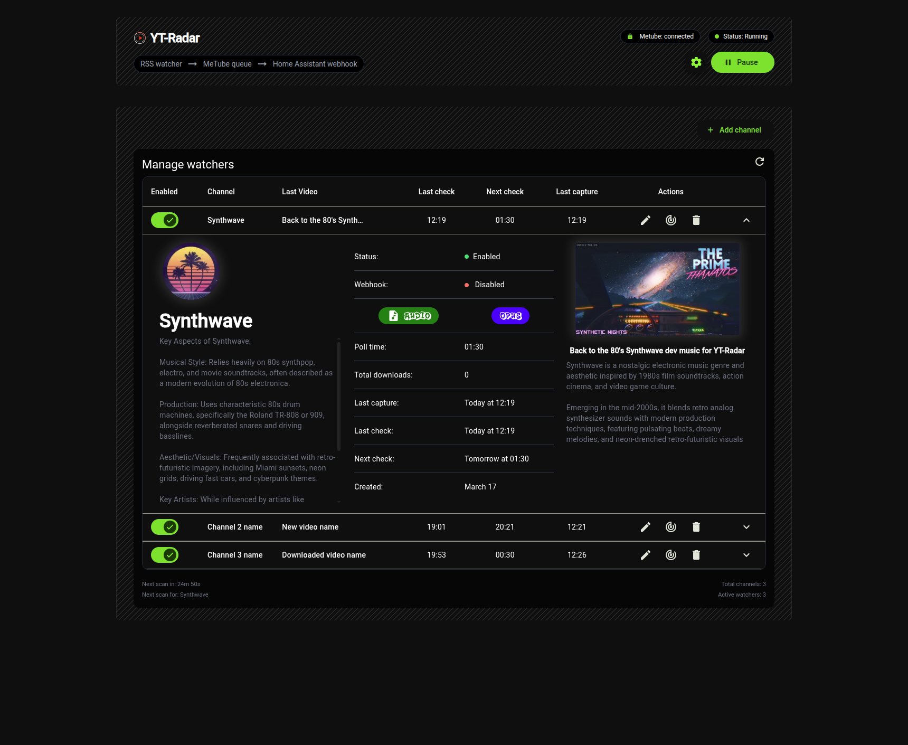
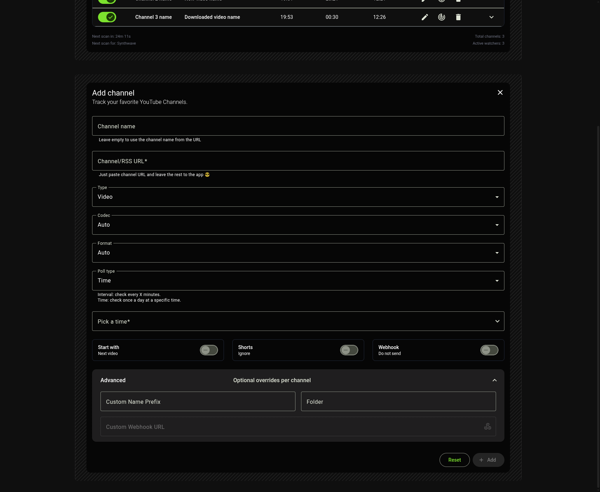

# Youtube RSS tracker

A modern, self-hostable web application for tracking videos from YouTube channels (RSS) with full TrueNAS SCALE compatibility.



## Features

- ✅ **Add YouTube channels** using Channel or RSS URL
- ✅ **Configure global and per-channel settings** (enable state, codec, format, poll schedule, shorts downloads, folder etc.).
- ✅ **Visual dashboard:** Easily see the current status, recent downloads, and channels being tracked.
- ✅ **Flexible polling:** Download new videos on a set interval or at a specific time of day.
- ✅ **Integrate with automation:** Sends notifications to Home Assistant via webhook after downloads.
- ✅ **MeTube support:** Integrates with [MeTube](https://github.com/alexta69/metube) for downloads.
- ✅ **API:** Create sensors/cards/automations using YT-Radar API (Last video, Next check, Health).

## Requirements

- **TrueNAS SCALE** or any system with Docker.
- [MeTube](https://github.com/alexta69/metube) instance running and accessible from this app.

## Quick Start
<i>TrueNAS Scale - Custom App installation recommendations</i>

```yaml
Application Name:
  application Name: YT-Radar

Image Configuration:
  image:
    repository:
      image: ghcr.io/aprilborn/yt-radar
      tag: testing
      pull policy: Pull the image if it's not present on the host.

Container Configuration:
  Timezone: '<Your_Timezone>'
  Environment Variables:
    DATA_DIR: /data
    NODE_ENV: production

Network Configuration:
  Ports:
    port bind mode: Publish port on hte host for external access.
    host port: 31080 (or any other available port)
    container port: 8000
    Protocol: TCP
  
Storage Configuration:
  Storage:
    Type: Host Path (Path that already exist on the system)
    Mount Path: /data
    Host Path: /mnt/tank/yt-radar/data

Resources Configuration:
  Enable Resource Limits: ✅
  Limits:
    CPUs*: 1
    Memory* (in MB)*: 256
```

- Open the web UI at [http://truenas-ip:31080](http://truenas-ip:31080).

## Setup for TrueNAS SCALE

1. Deploy [MeTube](https://github.com/alexta69/metube) as a separate Docker service using TrueNAS SCALE's Apps UI.
2. Deploy this project using the above instructions.
3. Set the MeTube URL in the app (use the internal network address if co-located).

## Usage

- **Add a Channel:** Click "Add Channel," paste a YouTube channel/playlist URL or RSS URL, and configure the download settings.
- **Configure Polling:** Choose "Interval" (every X minutes) or "Time" (once a day at a specific time).
- **Webhooks:** Enable notification to Home Assistant by toggling the Webhook option and providing a webhook URL.
- **Tags/Folders:** Organize channels using tags.
- **Download Shorts:** Toggle to include or exclude YouTube Shorts per channel.
- **Advanced:** Set a custom name prefix, tag, or per-channel webhook if needed.

## Settings

- **MeTube URL:** Set the URL of your running MeTube instance.
- **Global Webhook:** Home Assistant or other webhooks for notification (can override per-channel).

## Developer Quick Start

```bash
# Install dependencies
cd frontend && npm install
cd ../backend && npm install

# Run in development mode
cd ../frontend && pnpm start
# In another terminal:
cd ../backend && npm run dev
```

## Screenshots

<!-- Add screenshots/gifs of the UI here if available -->




## Roadmap

- [ ] Channel Order
- [ ] Channel Groups
- [ ] Download history & statistics
- [ ] More notification integrations

---

**Made for TrueNAS SCALE. Powered with Angular, Fastify, Drizzle ORM, and SQLite.**

> Looking for a feature or found a bug? Open an issue or PR!
