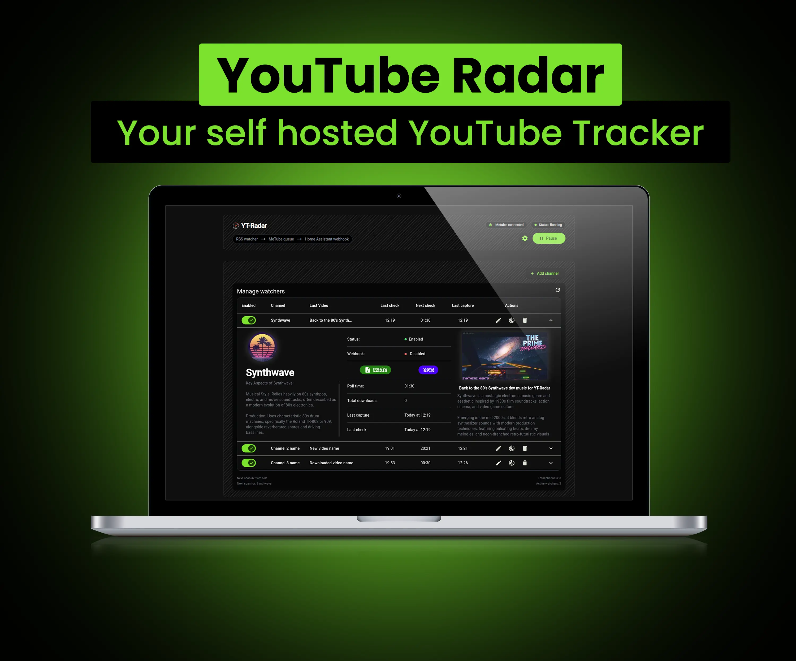
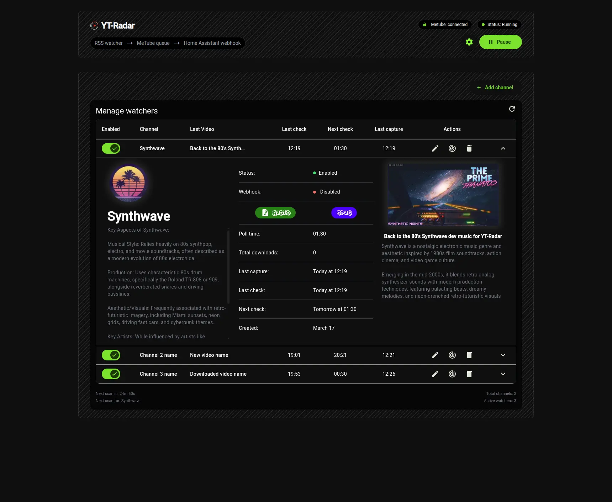
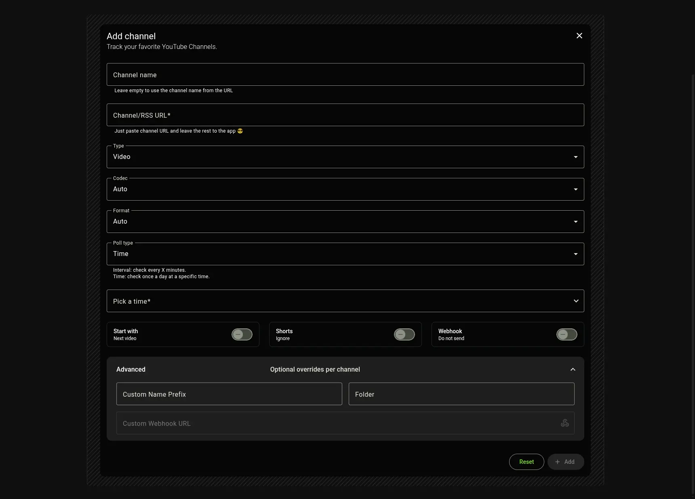

# YT Radar

**Automatically track YouTube channels and send new videos to MeTube.**

No subscriptions. No ads. No limitations.



## What is this?

YT Radar watches YouTube channels via RSS and automatically sends new videos to your MeTube instance.

Perfect if you:
- Run a home server
- Archive YouTube content
- Have [MeTube](https://github.com/alexta69/metube) running
- Want automation instead of manual downloads

## Features

- 📡 Track channels via RSS
- ⏱ Flexible polling (interval or specific time)
- 🎬 Auto-download via MeTube
- 🎯 Per-channel settings (type, format, codec, shorts, folder, etc.)
- 🧠 Smart tracking (remembers last video)
- 🔔 Webhooks (Home Assistant support)
- 🖼️ Iframes (Home Assistant frame card)
- 📊 Informative dashboard (status, activity, channels)

## How it works

1. Set your MeTube instance
2. Click <button>+ Add Channel</button>
3. Add a YouTube channel or RSS URL
4. Choose polling mode
5. Save

That's it.

## Screenshots




## Tips
- To see webhook payload example — open settings, add your url and press in webhook icon. \
You will see JSON in second notification.
- Home Assistant card with last/new video:
  - Create frame card with url like http://yt-radar:31080/widget/watcherId \
  To see watcher id — expand watcher and hover on channel name. 

## Requirements

- Any system with Docker.
- [MeTube](https://github.com/alexta69/metube) instance running and accessible from this app.

## Quick start (Docker)

```bash
docker run -d \
  -p 31080:8000 \
  -v /your-directory/data:/data \
  -e DATA_DIR=/data \
  ghcr.io/aprilborn/yt-radar:latest
```

## Setup for TrueNAS SCALE
<i>TrueNAS Scale - Custom App installation recommendations</i>

```yaml
Application Name:
  application Name: yt-radar

Image Configuration:
  image:
    repository:
      image: ghcr.io/aprilborn/yt-radar
      tag: latest
      pull policy: Pull the image if it's not present on the host.

Container Configuration:
  Timezone: '<Your_Timezone>'
  Environment Variables:
    DATA_DIR: /data
    NODE_ENV: production

Network Configuration:
  Ports:
    port bind mode: Publish port on hte host for external access.
    host port: 31080 (or any other available port)
    container port: 8000
    Protocol: TCP
  
Portal Configuration:
  Name*: Web UI
  Protocol*: HTTP
  Use Node IP*: ✅
  Port*: 31080
  Path*: /

Storage Configuration:
  Storage:
    Type: Host Path (Path that already exist on the system)
    Mount Path: /data
    Host Path: /mnt/tank/yt-radar/data

Resources Configuration:
  Enable Resource Limits: ✅
  Limits:
    CPUs*: 1
    Memory* (in MB)*: 256
```

- Open the web UI at [http://truenas-ip:31080](http://truenas-ip:31080) (*port you selected for "host port"*).

---

## Developer Quick Start

```bash
# Install dependencies
pnpm setup

# Run in development mode
pnpm dev

# Build prod
pnpm build
```

## Roadmap

- [ ] Refactoring 😄
- [ ] Improve UI (alternative view, themes, responsiveness)
- [ ] Channel ordering
- [ ] Channel groups
- [ ] Allow manual channel avatar and description updates
- [ ] Enhance polling
- [ ] Translations
- [ ] Tips

---

> Looking for a feature or found a bug? Open an issue or PR!
